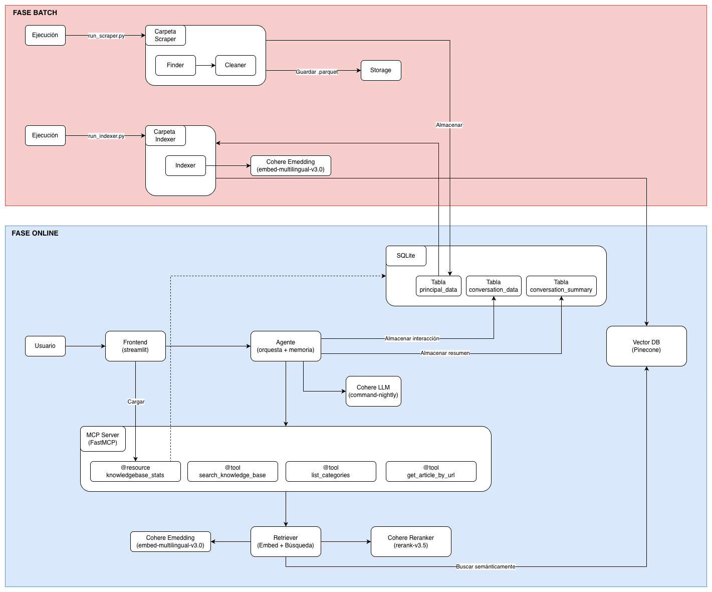

# Bancolom-IA

Asistente virtual del Grupo Bancolombia funciona basado en una arquitectura **RAG (Retrieval-Augmented Generation)** donde un agente utiliza servidor canal tipo **MCP (Model Context Protocol)**. El sistema extrae información del sitio web de Bancolombia para personas, la indexa semánticamente y responde preguntas a través de un agente conversacional con memoria multi-nivel.

El siguiente Diagrama de Componentes refleja el funcionamiento general del sistema.



---

## Arquitectura

El sistema se divide en dos fases:

### Fase Batch (ingesta de datos)

1. **Scraper** (`run_scraper.py`) — Inicializa un Playwright que navega la página `bancolombia.com/personas` mediante el uso de un navegador `Chromium`, recorriendo las diferentes páginas y extrayendo la información con ayuda del algoritmo BFS acotado de acuerdo a las configuraciones presentadas, respetando `robots.txt` y un delay de 0.5 s entre requests. Al final, guarda el HTML crudo en `.parquet`.
2. **Cleaner** (`run_scraper.py`) — Elimina tags de ruido (`nav`, `footer`, `script`, banners por clase CSS) y extrae texto con jerarquía de encabezados en formato Markdown.
3. **Persistencia** (`run_scraper.py`) — El texto limpio se almacena en SQLite en la tabla `principal_data` con metadatos como: URL, título, fecha de extracción y categoría (inferida de la ruta URL).
4. **Indexer** (`run_indexer.py`) — Segmenta el texto en chunks de 400 palabras con overlap de 50, genera embeddings con **Cohere embed-multilingual-v3.0** (1024 dims) y los almacena en **Pinecone** (mediante coseno) junto con los metadatos completos.

### Fase Online (Interacción Usuario - Agente)

1. **Servidor MCP** (FastMCP, con transporte `stdio`) — Expone 3 tools y 1 resource:
   - `search_knowledge_base` — Realiza la búsqueda semántica y reranking (Cohere rerank-v3.5) con top 3 documentos con fuentes.
   - `get_article_by_url` — Dvuelve el completo de una URL que se ha almacenado en SQLite.
   - `list_categories` — Lista las categorías disponibles con conteo de artículos almacenado en SQLite.
   - `knowledgebase://stats` — Muestra estadísticas generales de la base de conocimiento.
2. **Agente** (Actua como cliente MCP) — Conecta al servidor MCP vía `stdio`, decide que tool invocar y genera la respuesta final con **Cohere command-nightly**.
3. **Frontend** (Streamlit) — Chat con historial, citación de fuentes como URLs expandibles y panel lateral con estadísticas de la base de conocimiento vía MCP resource.

### Memoria conversacional

El agente maneja tres niveles de memoria:

- **Corto plazo** — Últimos 3 turnos de conversación (configurable).
- **Mediano plazo** — Resumen automático generado cada 5 turnos, almacenado en SQLite (`conversation_summary`).
- **Largo plazo** — Aunque no está implementado de una forma explícita, toda la conversación se persiste en SQLite (`conversation_data`) con tokens, modelo y tiempos de respuesta.

---

## Estructura del proyecto

```
├── backend/
│   ├── core/              # Config (singleton), modelos de datos, carga de prompts
│   ├── scraping/          # Finder y Cleaner
│   ├── indexing/          # Chunking + Generación de embeddings + Inserción
│   ├── rag/               # Retriever
│   ├── mcp/               # Servidor FastMCP: tools y resources
│   ├── agent/             # Agente conversacional (cliente MCP)
│   ├── interfaces/        # Contratos abstractos (ABC) para cada proveedor
│   ├── providers/         # Implementaciones: Embedding, LLM, Reranker, Vector DB, DB
│   ├── factories/         # Patrón de Fábrica para ejemplificar proveedores por config
│   └── prompts/           # Prompts versionados en YAML
├── frontend/              # Aplicación Streamlit
├── scripts/               # Scripts de ejecución batch (scraper, indexer)
├── tests/                 # Tests unitarios con pytest + mocks
├── config/config.cfg      # Configuración centralizada (no secrets)
├── docker-compose.yml     # Orquestación de servicios con Docker
├── Dockerfile             # Imagen Docker
└── docs/resources/        # Diagrama de componentes
```

---

## Decisiones técnicas

### Adquisición de datos (Web Scraping)

Debido a que la página de Bancolombia renderiza la mayoría del contenido con JavaScripts, se usó Playwright para levantar un Chromium de verdad, con ello, espera a que todo el el contenido cargue (`wait_until="domcontentloaded"`) y posterior a ello se puede extraer el HTML completo con `BeautifulSoup`

Para la búsqueda se implementó un algoritmo de búsqueda en anchura, un Breadth-First Search (BSF) sobre la página principal `bancolombia.com/personas` con dos límites, máximo 50 páginas y una profunidad de 5. Esta profundidad llega bien a páginas como `/personas/creditos/vivienda/credito-vivienda`. Es necesario aclarar que se incluyen páginas que sean del dominio del banco y además empiecen con `/personas`. Con BFS se prioriza las páginas más cercanas a la raíz, que tienden a ser más generales, y ya después bajo a detalle.

Debido a que la página tiene mecanismos de protección anti-robot que peude reflejarse con la permanencia de un archivo `robots.txt`, por esa razón y para mantener la seguridad de la página y que las peticiones no sean bloqueadas, se respeta con un RobotFileParser + el delay de 0.5 segundos entre requests. Por otra parte, si la página no puede ser procesada por un nivel de seguridad más alto, se implementó un `try/except` que si falla por timeout o lo que sea, se loguea y se sigue con la siguiente.

### Procesamiento y limpieza

La limpieza se realiza en dos sub-pasos:
- Primero elimino todo lo que no aporta contenido: tags como `nav`, `header`, `footer`, `script`, `style`, `iframe`, `form`, `svg`, `img`, y también cualquier elemento cuya clase CSS contenga cosas como `banner`, `cookie`, `breadcrumb`, `sidebar`, `popup`, `modal`.
- Segundo, extraigo el texto preservando la jerarquía: los `<h1>` a `<h4>` los convierto a Markdown (`#` a `####`), y los `<p>`, `<li>`, `<td>` quedan como texto plano. Esta estructura esa estructura ayuda bastante al chunking y a que el LLM entienda de qué va cada sección.

Por otra parte hay una función de 'normalización' en la cual se eliminan espacios múltiples y saltos de línea excesivos, y filtro caracteres raros concervando los acentos español posibles: ñ, ¿, ¡, y símbolos como $ y €.

### Chunking

Se eligió chunks de 400 palabras con overlap de 50, es un buen balance (\~500-600 tokens en español). Se ajusta suficiente contexto para que el chunk tenga sentido por sí solo, y con ello se pueden agregar 3 chunks en el prompt del LLM sin pasarme de `max_tokens`. El overlap de 50 palabras (~12.5%) es para no perder información en las fronteras, es decir, si un concepto empieza al final de un chunk, el siguiente lo recoge.

Además, la implementación fue un chunking semántico (cortar por párrafos o secciones), pero el contenido de Bancolombia puede ser bastante irregular en ocasiones, es decir, algúnas páginas traen párrafos largos, otras son puras listas cortas. La ventana fija con overlap se comporta de forma más predecible con ese tipo de dataset heterogéneo.

### Modelo de embeddings

Se usó el modelo **Cohere `embed-multilingual-v3.0`** con 1024 dimensiones (valor por defecto) por tres razones concretas.
- 1. El contenido de Bancolombia está en español, por ende se necesitaba un modelo que maneje español.
- 2. 1024 dimensiones es la representación por defecto que utiliza el tier gratuito de este modelo, además añade una representación rica del contenido sin ser excesiva para el tier gratuito de Pinecone.
- 3. Cohere separa `input_type="search_document"` para indexar e `input_type="search_query"` para consultar, lo que mejora la calidad del retrieval porque optimiza la representación según el rol del texto.

### Base de datos vectorial

Se uso **Pinecone** como índice principal por esta razón:
- Cuenta con un tier gratuito que incluye un índice sin tener que provisionar nada, y además permite filtrado por metadatos lo cual favorece mucho al momento de realizar búsquedas. Estos metadatos (URL, título, categoría, fecha, texto) se almacenan directamente en el chunk, con esto se evita tener que hacer joins con la base relacional durante el retrieval.

### Retrieval: búsqueda semántica + reranking

La recuperación funciona en dos etapas
1. Primero se realiza la búsqueda de los top-10 en Pinecone por similaridad coseno, pues aunque es rápido pero puede traer falsos positivos.
2. Después paso esos 10 candidatos por un modelo **Cohere `rerank-v3.5`**, que evalúa cada par (query, documento) y se queda con los 3 más relevantes. La búsqueda vectorial compara embeddings precalculados y captura semántica general, pero se le escapan matices. El reranker procesa query y documento juntos y entiende relaciones más finas.

Estos valores de top_k=10 y top_n=3 son ajustables empíricamente. 10 candidatos dan suficiente variedad sin hacer la búsqueda costosa, y 3 documentos finales son suficientes para que el LLM arme una respuesta completa sin diluirse con información redundante.

### Servidor MCP: decisiones de diseño

El servidor MCP funciona como un canal entre el Agente (Orquestador) y las herramientas y recursos existentes, de la siguiente forma:

- El servidor MCP Recibe queries, hace retrieval y devuelve documentos con fuentes. La construcción del prompt, la memoria conversacional y la invocación del LLM quedan del lado del agente. Esto es una ventaja puesto que el servidor es reutilizable por cualquier cliente sin asumir qué LLM se va a usar, la memoria es responsabilidad del agente (no del servidor de datos) y además se permite testear la recuperación de forma aislada.

- Cada tool tiene una descripción detallada con ejemplos de uso, parámetros y retorno. Son esas descripciones las que el LLM lee para decidir qué tool invocar, y si no hay ningún `if/else` en el agente para seleccionar tools, el LLM lo resuelve solo con el tool use nativo, búsqueda semántica.

- Para el transporte se implementó `stdio` porque es el más simple para ejecución local: el agente levanta el servidor como subproceso y se comunican por stdin/stdout. Sin embargo, para un despliegue real habría que migrar a SSE o Streamable HTTP.

### Agente conversacional

El agente sigue un ciclo de dos pasos explícitos:

Primero llama al LLM junto con las tools disponibles. Si el LLM decide invocar alguna, el agente la ejecuta vía MCP, recoge el resultado y hace un segundo llamado con ese resultado inyectado como mensaje tipo `tool`. Si el LLM no necesita tools (saludos, preguntas fuera de alcance), responde directo en un solo paso.

Para la memoría se implementó en 3 niveles:

- **Corto plazo:** Se ajusta una variable a 3 interacciones anteriores que se inyectan en el prompt. Puedes referencias inmediatas como "¿y la tasa?" o "cuéntame más". Cada interación recupera los N (3) mensajes anteriores

- **Mediano plazo:** Cada 5 turnos genero un resumen de toda la conversación usando el LLM con un prompt específico. Ese resumen captura qué temas se han consultado y qué intenciones tiene el usuario. Se guarda en `conversation_summary` y se inyecta al inicio del prompt. Así evito que el contexto crezca sin límite pero mantengo el hilo general.

- **Largo plazo:** Aunque no es una implementación explícita, todas las interacciones quedan persistida SQLite en `conversation_data` con metadatos completos (tokens, modelo, versión del prompt, tiempo de respuesta). Queda disponible para análisis o para implementar algo más sofisticado en el futuro.

### Arquitectura de software

- Cada proveedor externo tiene una interfaz abstracta con el contrato, y una implementación concreta. Los métodos fábricas ejemplifican el proveedor correcto según `config.cfg`. Por lo anterior, si se reequiere cambiar de Cohere a OpenAI, se debe crear un `OpenAIHandler` que implemente `LLMInterface`, lo registro en `LLMFactory` y cambio `provider = openai` en la config.

- La configuración está centralizada en `ConfigLoader`, un singleton thread-safe que carga `config.cfg` y `.env` una sola vez. Todo se accede con propiedades tipadas (`config.llm_model`, `config.vector_db_top_k`, etc).

- Los prompts están versionados en YAML (`chat_v1.yml`): Cada prompt cuenta con un *system prompt* y un *user_template* de usuario y metadatos de versión. Esto me permite iterar sobre el prompt sin tocar código.

---

## Requisitos previos

- Docker y Docker Compose
- Claves API: **Pinecone** (gratuito) y **Cohere** (gratuito)

---

## Instalación y ejecución

### 1. Clonar y configurar variables de entorno

```bash
git clone https://github.com/dalzoj/bancolom_ia.git
cd bancolom-ia
cp .env.example .env
```

Editar `.env` con las claves reales, así:

```
PINECONE_API_KEY=tu_clave_pinecone
COHERE_API_KEY=tu_clave_cohere
APP_PASSWORD=contraseña_para_el_chat
```

### 2. Ejecutar el pipeline de datos (una sola vez)

```bash
# Scraping: extrae y limpia páginas de bancolombia.com/personas
docker compose run --rm scraper

# Indexación: genera embeddings e indexa la información en Pinecone
docker compose run --rm indexer
```

> Estos servicios están en el profile `pipeline` y no se levantan con `docker compose up`.

### 3. Levantar la aplicación

```bash
docker compose up --build
```

Acceder a `http://localhost:8501`, ingresar la contraseña definida en `APP_PASSWORD`.

### 4. Ejecución local sin Docker (desarrollo)

```bash
pip install poetry
poetry install

# Instalar Chromium para Playwright (necesario para el scraping)
playwright install chromium --with-deps

# Pipeline
python scripts/run_scraper.py
python scripts/run_indexer.py

# App
streamlit run frontend/app.py
```

---

## Tests

```bash
pytest tests/ -v
```

Los tests cubren: Finder (normalización de URLs, filtrado de links, categorías), Cleaner (remoción de ruido, extracción de jerarquía), Indexer (chunking, manejo de errores), tools MCP (search, get_article, list_categories) y el agente (ciclo de vida, manejo de tool calls, persistencia).

---

## Configuración

Toda la configuración no sensible está en `config/config.cfg`:

- `[scraping]` — URL base, máx. páginas, profundidad, delay, respeto a robots.txt.
- `[vector_db]` — Proveedor, índice, dimensión, métrica, top_k.
- `[reranking]` — Habilitado/deshabilitado, modelo, top_n.
- `[embedding]` — Modelo y dimensión.
- `[llm]` — Modelo, max_tokens, temperatura.
- `[conversation]` — Límite de historial, frecuencia de resumen.

---

## Limitaciones conocidas

- El scraping no cubre el 100% del sitio; algunas páginas con carga dinámica compleja o protección anti-bot pueden fallar. Además el tier de Pinecode limita la inserción de embeddings.
- El tier gratuito de Cohere tiene rate limits que pueden afectar la velocidad del indexado masivo.
- SQLite no soporta concurrencia de escritura; para múltiples usuarios simultáneos se requeriría migrar a bases de datos más robustas puedesn ser SQL o NoSQL.
- El transporte MCP es `stdio` (local); para despliegue distribuido se necesitaría SSE o Streamable HTTP.

---

## Autor

**Diego Lizarazo** — imdlizarazo@gmail.com
